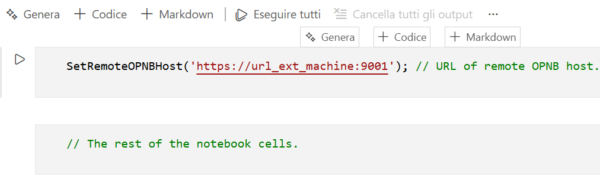

# Object Pascal Notebook
## VSCode Notebook by Object Pascal.

This extension allows you to have notebooks in Object Pascal.

The script execution engine uses the excellent [**DWScript**](https://github.com/EricGrange/DWScript) library; in addition to implementing most of the Delphi syntax, the library introduces many improvements to the language, such as the implementation of a garbage collector for object lifecycle management.
To learn more about all the features the library offers, in addition to referring to the related online documentation, we recommend studying the test cases available at this [address](https://github.com/EricGrange/DWScript/tree/master/Test).

**Notice**: If you would like to collaborate to make this extension available for operating systems other than Windows, please read [here](#help-needed).

## Notebook Example

To activate the extension, simply create or open a file with the extension **opnb**.
VSCode will display the usual notebook interface.
After that, simply populate the notebook with our code cells and Markdown descriptions:


## The OPNBHost Process

Each notebook opened in VSCode delegates the execution of its cells to a dedicated application called **OPNBHost**. This application is automatically launched by the extension whenever necessary and is responsible for executing and returning the results of each executed cell. **OPNBHost** implements an HTTP server that enables communication between the extension and the application itself.
The default HTTP listening port is 9000, but the user can change it as desired using the extension's corresponding option.

### Antivirus Issues

OPNBHost is an HTTP server, and its activity of opening an HTTP port could make it suspicious to an antivirus program. Antivirus programs typically display a message asking whether the file is trustworthy or not. In these cases, simply answering yes will avoid future problems. If this doesn't happen, simply add OPNBHost to your antivirus program's exclusion list.

### OPNBHost Failure

If a notebook encounters problems outside of the expected range, the problem is most likely due to a host failure. To resolve this issue, simply forcefully terminate the OPNBHost process; the extension will automatically restart it the next time a cell is executed.

## The "Restart" Special Instruction

Once a notebook is executed, its execution context is maintained by OPNBHost. Therefore, as types, structures, variables, and so on are declared, everything is kept persistent by the host and made available for subsequent execution of other cells.

If at some point you need to delete the entire execution context of a notebook because you want to re-run it from the beginning as if it were the first time, simply use the special **Restart** instruction:


The **Restart** instruction must be the only instruction within a cell.

## Formatting Cell Output

The following notebook [example](Examples/Notebooks/Output%20examples.opnb) shows how to generate formatted output for our cells to meet our display needs, more complex than simply displaying a message.

## Import Libraries

You can import all the libraries needed to run your notebook into a notebook. These libraries can be written by you for your own purposes or used by others.
To import a library, you can use the special **Import** statement, which has the following prototype:

```Delphi
Import('Namespace', 'Library Path');
```

The first parameter, *Namespace*, although not currently used, must be specified and must be unique with respect to other *import* statements.
The second parameter must be the path to the folder containing the library files to be referenced.

The following example [notebook](Examples/Notebooks/SimpleMath.opnb) shows how to import a library defined in DWScript.

### Import Process Algorithm

When the **Import** statement is executed, it will implement the following steps:

1. Starting from the path of the specified folder, all files with the extensions *pas, dll, so, and dylib* are listed (the extensions of dynamic libraries will depend on the operating system). The search also extends in depth, recursively iterating through all subfolders encountered.
2. Once the census is complete, for each file:
- If the file has the *pas* extension, it is considered a *Unit* library and made available to all notebook cells. Cells will not need to specify the *Uses* statement to use these libraries, as these declarations are implicit.
- If the file is a dynamic library, then OPNB will load that library into the process, provided that the library is indeed an OPNB-compliant library. We'll see how to write a compliant library later. The purpose of these dynamic libraries is to make external applications, frameworks, and native resources available to our notebook.

## Writing a Compliant Library

In this chapter, we'll explain how to write a dynamic library that OPNB can load and make available to our notebooks.

As we'll explain later, the OPNB program is written in Delphi, using the FMX framework to generate executables for multiple operating systems (those supported by FMX).

Dynamic libraries, currently, must also be written in Delphi FMX.

That said, in the future, if truly necessary, we could consider using any other language, such as C or C++. To do this, we'll need to design data structures that allow data exchange without memory conflicts and related *memory leaks* and that work on different operating systems.

### General Architecture

Normally, for cleaner and easier use, the code in the cells will not communicate directly with a dynamic library; This is because, even if this is indeed possible, the code would be extremely complex and complicated, in addition to the fact that the cell would need to know the communication protocol between OPNB and the imported library, which, for libraries not written by us, is not necessarily possible.

Therefore, the recommended architecture for a library author is to provide one (or more) *Units* that act as an interface between the notebook and the dynamic library:


The interface unit will provide notebooks with all available functionality, as documented by the library authors; all implementation and communication details between the interface unit and the dynamic library will be internal to the library itself and will not be visible from the outside.

We will use the [**MemoryMatrices**](Examples/MemoryMatrices) example library as a model for the explanations that follow.

### Writing the Dynamic Library

A dynamic library must expose the following two procedures:

```pascal
procedure LibInit(const ALibInterface: PLibInterface); cdecl;
begin
with ALibInterface^ do
begin
LibGUID:='{2970D979-84FB-4B42-B730-F596BEC20E2F}';
InvokeLibProc:=InvokeLibProcImpl;
end;
// Follow the initialization code
end;

procedure LibFree(const ALibInterface: PLibInterface); cdecl;
begin
// Follow the resources release code
end;

exports
LibInit,
LibFree;
```

Without the **LibInit** and **LibFree** procedures, the OPNB process will never load our library.

The project will have to use the **uLibInterface** unit which will declare all the necessary types and records:

```pascal
type 
TInvokeLibProc = function(Context, Instance: NativeInt; const ProcName: PChar; var Args:array of variant): Variant; cdecl; 

PLibInterface = ^TLibInterface; 
TLibInterface = record 
Version: Integer; 
Context: NativeInt; 
Namespace: PChar; 
ExecutionPath: PChar; 
LibHandle: TDynLibHandle; 
LibGUID: PChar; 
InvokeLibProc: TInvokeLibProc; 
end;
```

The **LibInit** procedure receives a pointer to the **TLibInterface** record; There are two fields in this record that must be filled in for the OPNB process to acquire them:

1. **LibGUID**
2. **InvokeLibProc**

The **LibGUID** field must be filled in with the GUID that will allow our library to be identified within the process. Each OPNB-compliant library must have its own unique GUID. This information, as we will see, is essential for enabling the link between the dynamic library and the library's interface units.

The **InvokeLibProc** field must be filled in with a pointer to the communication procedure between the OPNB process and the dynamic library, which must be of the **TInvokeLibProc** type, as seen above.
When the OPNB process requests functionality, it will do so by invoking this procedure appropriately.

### The **MemoryMatrices** Library

Having illustrated the rules and basic structure of our library, we continue our explanation using the **MemoryMatrices** sample library.

This library aims to enable basic operations between vectors and matrices, but performed not at the script level but at the machine code level. In fact, both the cell and unit code are executed through its runtime interpretation, whereas the code of a dynamic library is executed natively and therefore significantly faster.

The library provides the following features:
1. Memory allocation of vectors and matrices of any size.
2. Reading and writing an allocated vector or matrix.

3. Operations:
- Multiplication
- Transposition
- Addition
- Subtraction
- Hadamard
- Scalar Multiplication

#### The MemoryMatrices Dynamic Library Project

This Delphi FMX project implements our sample dynamic library. To ensure it is a compliant library, it
will define the two procedures **LibInit** and **LibFree** as follows:

```pascal
procedure LibInit(const ALibInterface: PLibInterface); cdecl;
begin
with ALibInterface^ do
begin
LibGUID:='{2970D979-84FB-4B42-B730-F596BEC20E2F}';
InvokeLibProc:=InvokeLibProcImpl;
end;
MatrixDict:=TDictionary<integer, TMatrixEntry>.Create;
end;

procedure LibFree(const ALibInterface: PLibInterface); cdecl;
begin
FreeMatrixDict;
end;
```

It is not the purpose of this chapter to explain how the library manages the matrix lifecycle and implements the operations listed above; our focus is on how to enable communication between the OPNB process and the library. In fact, the library implements the procedure **InvokeLibProcImpl**, the one whose pointer was passed to the variable **InvokeLibProc**, as follows:

```pascal
function InvokeLibProcImpl(Context, Instance: NativeInt; const ProcName: PChar; var Args:array of variant): Variant; cdecl;
begin 
if (SameText(ProcName,'InstantiateMatrix')) then 
Result:=InstantiateMatrix(Args[0], Args[1], Args[2], Args[3]) 
else if (SameText(ProcName,'FreeMatrix')) then 
FreeMatrix(Args[0]) 
else if (SameText(ProcName,'ReadMatrixInfo')) then 
ReadMatrixInfo(Args[0], Args[1], Args[2]) 
else if (SameText(ProcName,'ReadMatrix')) then 
Result:=ReadMatrix(Args[0], Args[1], Args[2]) 
else if (SameText(ProcName,'WriteMatrix')) then 
WriteMatrix(Args[0],Args[1]) 
else if (SameText(ProcName,'RandomizeMatrix')) then 
RandomizeMatrix(Args[0],Args[1]) 
else if (SameText(ProcName,'MulMatrices')) then 
Result:=MulMatrices(Args[0],Args[1]) 
else if (SameText(ProcName,'TransposeMatrix')) then 
Result:=TransposeMatrix(Args[0]) 
else if (SameText(ProcName,'AddMatrices')) then 
Result:=AddMatrices(Args[0],Args[1]) 
else if (SameText(ProcName,'SubMatrices')) then 
Result:=SubMatrices(Args[0],Args[1]) 
else if (SameText(ProcName,'HadamardMatrices')) then 
Result:=HadamardMatrices(Args[0],Args[1]) 
else if (SameText(ProcName,'ScaleMatrix')) then
Result:=ScaleMatrix(Args[0],Args[1])
else
RaiseException('Proc "%s" unknown',[ProcName]);
end;
```

As noted above, whoever invokes the library from outside specifies:
- The reference to the object/resource, if any, via the **Instance** parameter.
- The name of the procedure/method via the **ProcName** parameter.
- The list of input and/or output variables to use in the invocation, via the **Args** parameter.

The code simply checks which procedure was invoked and calls the corresponding implementation procedure/function. Obviously, for each procedure invoked, the number of parameters and their meanings changes, and the caller must be aware of this.

#### The **uMemoryMatrices** Interface Unit

This [unit](Examples/MemoryMatrices/Lib/uMemoryMatrices.pas) represents the interface code between the user notebooks and the dynamic library. As explained above, this *unit* will provide the notebooks with the functionality provided by the library, in the most convenient way possible, while hiding the entire implementation of the dialog with the dynamic library.
The public definition of the *unit* is as follows:

```pascal
function InstantiateMatrix(const NumRows, NumCols: integer; Initialize: boolean=false; Value: float=0): integer;
procedure FreeMatrix(const MatrixHandle: integer);
procedure ReadMatrixInfo(const MatrixHandle: integer; var NumRows, NumCols: integer);
function ReadMatrix(const MatrixHandle: integer): TArrayVariantArray;
procedure WriteMatrix(const MatrixHandle: integer; Data: TArrayVariantArray);
procedure RandomizeMatrix(const MatrixHandle: integer; Bias: float=0.5);
function MulMatrices(const MatrixHandleA, MatrixHandleB: integer): integer;
function TransposeMatrix(const MatrixHandle: integer): integer;
function AddMatrices(const MatrixHandleA, MatrixHandleB: integer): integer;
function SubMatrices(const MatrixHandleA, MatrixHandleB: integer): integer;
function HadamardMatrices(const MatrixHandleA, MatrixHandleB: integer): integer;
function ScaleMatrix(const MatrixHandle: integer; S: float): integer;
```

As we can see, the *unit* defines all the procedures and functions that can be used by cells. An example of using the library can be found in this [notebook](Examples/Notebooks/Memory%20Matrices%20example%201.opnb).

To close the loop, we need to understand how the *unit* communicates with its corresponding dynamic library. To do so, let's take the implementation of the **ReadMatrixInfo** procedure as an illustrative example:

```pascal
implementation

const
LibGUID='{2970D979-84FB-4B42-B730-F596BEC20E2F}';

procedure ReadMatrixInfo(const MatrixHandle: integer; var NumRows, NumCols: integer);
var
Args: TVariantArray;
begin
Args.Push(MatrixHandle);
Args.Push(0);
Args.Push(0);
__LibInterface_InvokeLibProc(LibGUID, 0, 'ReadMatrixInfo', Args);
NumRows:=Args[1];
NumCols:=Args[2];
end;
```

As we can see, communication with a dynamic library occurs through the **__LibInterface_InvokeLibProc** function; the parameters to pass to this procedure are:
- The unique GUID of the procedure to which you want to send the command.
- The instance of the object to which the procedure to be invoked belongs; you can pass 0 if you are invoking a procedure/function and not a method.
- The list of input and/or output parameters.

**__LibInterface_InvokeLibProc** also returns the return value if the invoked name is that of a function.

## Running a notebook on remote machines

As we've seen, our notebook cells are executed by the OPNB process, which is launched on our local machine.

However, there may be cases in which it's better to run a notebook not on our machine, but on a more powerful one, or one with resources that our local machine doesn't have. To better understand a possible need, imagine a notebook that uses neural network libraries, which require an advanced GPU. In a scenario like this, we'd like to modify our notebook locally, but delegate its execution to the remote machine that has the necessary hardware capabilities.

This is possible by using the **SetRemoteOPNBHost** instruction at the beginning of our notebook:



The instruction must be the only instruction in the cell, and after its execution, all executions of the notebook's cells will be redirected to the specified host.
Obviously, an instance of the OPNB process must already be running on the remote machine, otherwise execution requests will be ignored.

### Security Considerations

Obviously, for security reasons, the OPNB host on the remote machine should be running so that it enables the HTTPS protocol. To do this, the application should be run with the following parameters specified:

- **UseSSL**: Boolean flag that enables the HTTPS protocol.
- **CertFile**: Name of the certificate file.
- **CertKey**: Name of the certificate key file.
- **CertPassword**: Certificate password.

For example:

```dos
OPNBHost -port "9001" -UseSSL true -CertFile "MyCert.cert.pem" -CertKey "MyCert.key.pem" -CertPassword "APassword"
```

However, enabling HTTPS alone isn't enough to guarantee security, because the OPNB process currently doesn't implement any access controls, and anyone who knows the process's listening URL could send execution requests.
This should be kept in mind if you want to activate an OPNB process intended to accept remote requests.

## Compiling OPNB

As we've already mentioned, the OPNB application was written in Delphi FMX and must be compiled using this language.
Furthermore, as seen above, [**DWScript**](https://github.com/EricGrange/DWScript) is used as the language for our notebooks. Therefore, to compile the extension, we need the relevant sources.

The repository contains a GIT submodule within the *vendor\DWScript* folder that points to the DWScript repository. Simply checkout this submodule to have all the sources available for compiling the program.

## Help needed!

Delphi FMX also allows you to generate executables for other operating systems, such as Linux and macOS. Unfortunately, I'm unable to generate executables for these operating systems, so I'm asking anyone willing to contribute, and who is also able to compile for these operating systems, to step forward and make this extension available for use outside of Windows.

Thank you!
